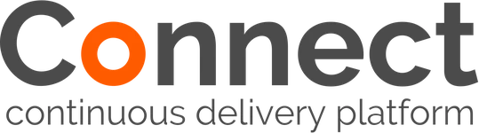
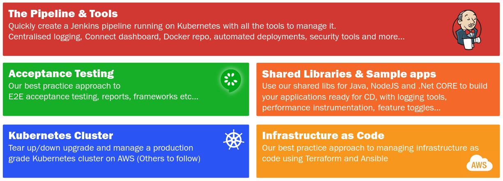

by link:https://clearpoint.co.nz[ClearPoint]

= Connect - Continuous Delivery Platform
Built by http://clearpoint.co.nz[ClearPoint] <connect@clearpoint.co.nz> v1.0 2017-07-07

The repo for this Documentation can be found on Github: https://github.com/ClearPointNZ/connect

image::https://api.travis-ci.org/ClearPointNZ/connect.svg[Build Status]

== Introduction
Welcome to the Connect Continuous Delivery Platform.

Connect is a collection of open source projects put together to help share best practice approaches to Continuous Delivery (CD) using containerisation (via Docker), orchestrated and deployed by Kubernetes.

The libraries are designed to be used either standalone or together and are grouped into the following areas:

== Repositories
Connect is made up of a number of repositories grouped into the following areas.

=== Acceptance Testing

=== Shared Libraries & Samples
https://github.com/ClearPointNZ/connect-tile-release[Connect tile release]::
It defines how a Maven project is to be released to Central and what plugins must run (and pass) for this to happen
https://github.com/ClearPointNZ/connect-sample-apps[Connect sample apps]::
Sample app running in a CD pipeline using all the shared libraries and tools we've built.

=== Infrastructure as Code

=== Pipeline and Tools
https://github.com/ClearPointNZ/connect-jenkins-bootstrap[Connect Jenkins Bootstrap]::
Bootstraps Jenkins and some plugins into a Kubernetes cluster.
TIP: See blog http://blog.connect.cd/2017/09/bootstrapping-jenkins-in-a-kubernetes-cluster/[Part 2: Bootstrapping Jenkins in a Kubernetes cluster]

=== Kubernetes
https://github.com/kz8s/tack[Tack]:: An open source Terraform module that helps us create a highly-available, redundant Kubernetes cluster on AWS.
TIP: See blog http://blog.connect.cd/2017/09/creating-a-kubernetes-cluster-on-aws/[Part 1: Creating a Kubernetes Cluster on AWS]

== Blogs

We are putting together a series of blogs on Connect as a guide to building a Continuous Delivery (CD) pipeline on top of Kubernetes.

http://blog.connect.cd/2017/09/bootstrap-continuous-delivery-with-connect/[Introduction to Connect]

http://blog.connect.cd/2017/09/creating-a-kubernetes-cluster-on-aws/[Part 1: Creating a Kubernetes Cluster on AWS]

http://blog.connect.cd/2017/09/bootstrapping-jenkins-in-a-kubernetes-cluster/[Part 2: Bootstrapping Jenkins in a Kubernetes cluster]

//TODO turn this into a table (image from connect ppt)

//include::includes/installation.adoc[]

include::includes/kubernetes.adoc[]

include::includes/jenkins.adoc[]

//include::includes/pipeline.adoc[]

//include::includes/infrastructure.adoc[]

//include::includes/samples.adoc[]

//include::includes/testing.adoc[]

include::includes/support.adoc[]

include::includes/license.adoc[]

include::includes/footer.adoc[]
